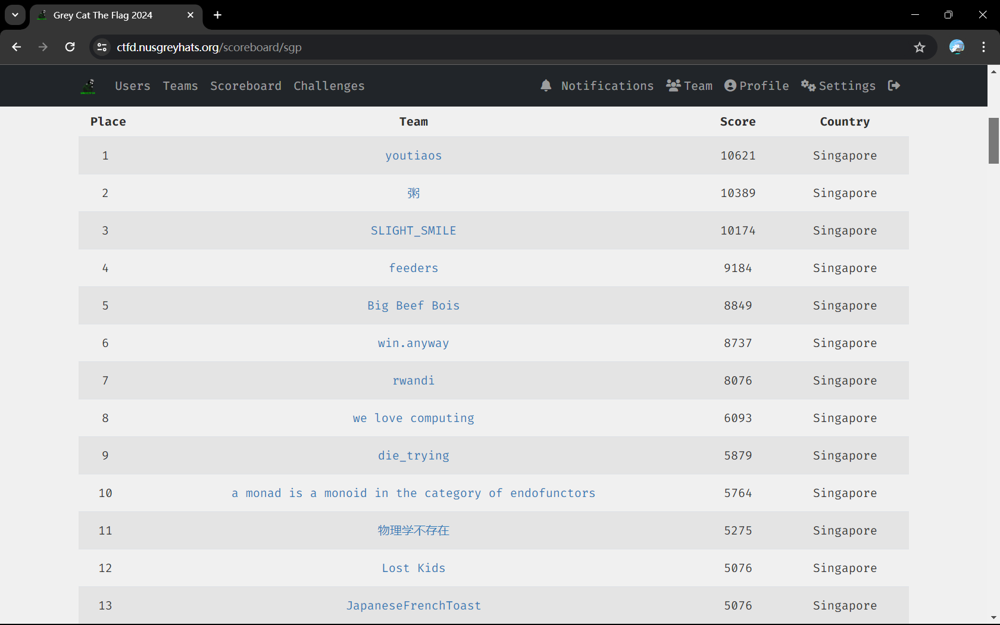

<h1> Grey Cat The Flag 2024 Writeup </h1>

Hello, we are team **Lost Kids** from National University of Singapore. 

From 20th to 21st April, we participated in **Grey Cat The Flag 2024** qualifiers hosted by **NUS Greyhats**. We managed to obtain 5076 points, which placed us the 22nd place among all teams and the 12th place among local teams. We are excited to be qualified for the final round!

<h3> Links to challenge writeups </h3>

[Baby Fmtstr](./pwn/baby-fmtstr/README.md)

[Filter Plaintext](./crypto/filter_plaintext/README.md)

[Grey Divers](./misc/grey-divers/README.md)

[Greyctf Survey](./web/greyctf-survey/README.md)

[Phaser JS](./rev/phaser-js/README.md)

<h3> Relevant websites </h3>

[CTF website](https://ctfd.nusgreyhats.org/)

[CTFTime event](https://ctftime.org/event/2242)

[NUS Greyhats](https://nusgreyhats.org/) (Thank u for this fun CTF!! :))

