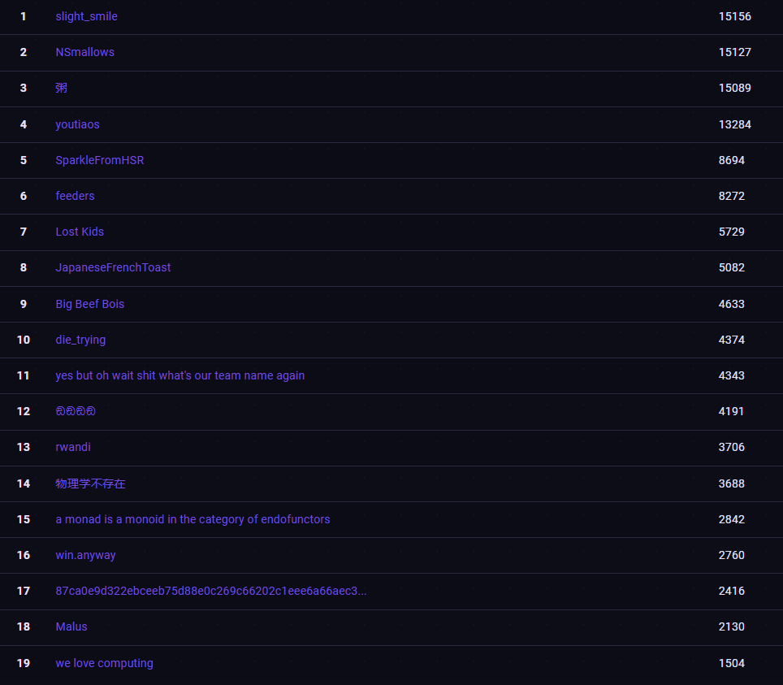

<h1> Grey Cat The Flag 2024 Writeup </h1>

Hello, we are team **Lost Kids** from National University of Singapore. 

From 20th to 21st April, we participated in **Grey Cat The Flag 2024** qualifiers hosted by **NUS Greyhats**. We managed to obtain 5076 points, which placed us the 22nd place among all teams and the 12th place among local teams. We are excited to be qualified for the final round!

We competed in the final round from 27th to 28th July. For the first time, we pulled through the entire 24 hours as a team, and we managed to obtain the 7th place with 5729 points. We really enjoyed this fun and thrilling learning experience. A HUGE thank you to **NUS Greyhats** for the wonderful welfare, vibing music & activities, and such well-designed challenges!

<h3> Links to challenge writeups </h3>

<h5> Qualifiers </h5>
* [Baby Fmtstr](./qualifiers/pwn/baby-fmtstr/README.md)
* [Filter Plaintext](./qualifiers/crypto/filter_plaintext/README.md)
* [Grey Divers](./qualifiers/misc/grey-divers/README.md)
* [Greyctf Survey](./qualifiers/web/greyctf-survey/README.md)
* [Phaser JS](./qualifiers/rev/phaser-js/README.md)

<h5> Finals </h5>

<h3> Relevant websites </h3>
* [CTF website](https://ctfd.nusgreyhats.org/)
* [CTFTime event](https://ctftime.org/event/2242)
* [NUS Greyhats](https://nusgreyhats.org/)

