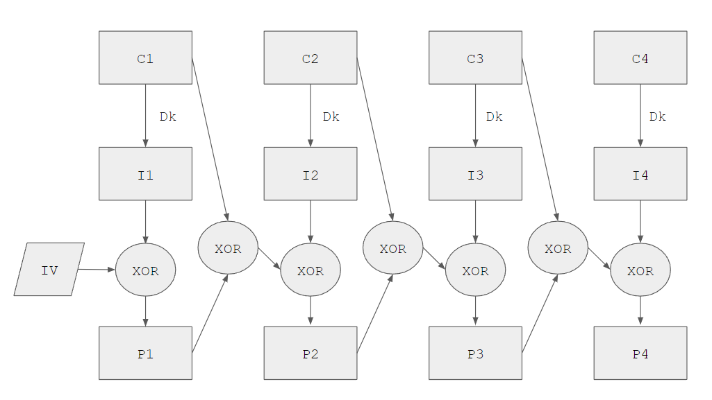
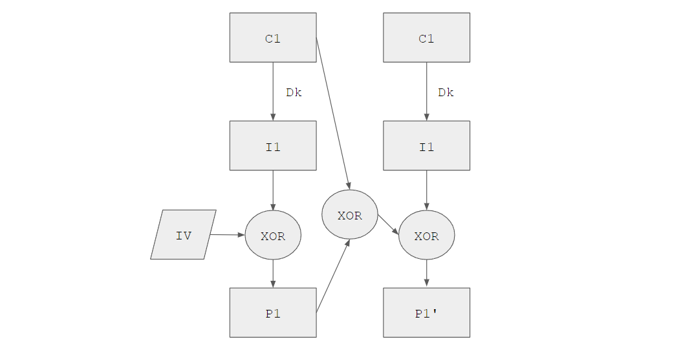
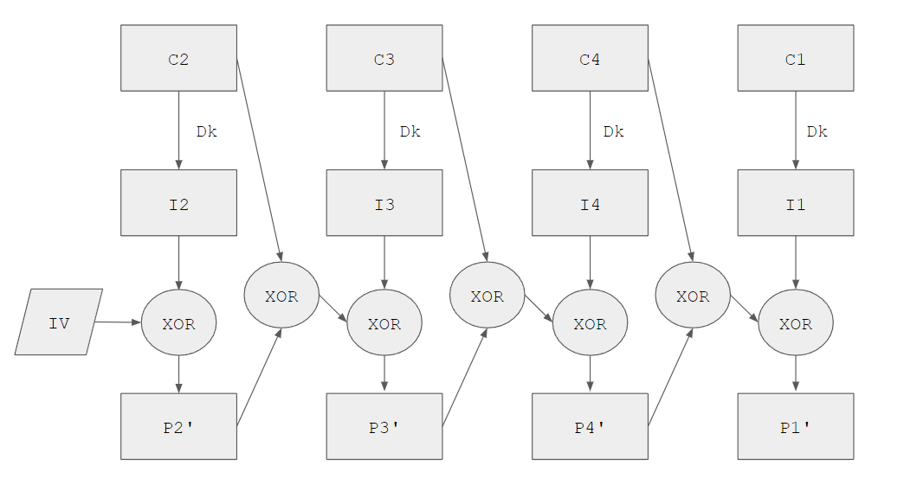

<h1>Filter Plaintext</h1>

<h3>Challenge (481 points, 39 solves)</h3>

> Maybe this will work?
>
> Author: hadnot
>
> ```
> nc challs.nusgreyhats.org 32223
> ```

The server first encrypts a random key using an encryption method similar to AES ECB, with a random IV. It shows the encrypted key, then allows user to provide any ciphertext, decrypts it using the same ECB method and same IV. It then displays the plaintext with any block in the original key removed.

The server also uses AES CBC mode with the secret key above and a different IV to encrypt the flag. It displays the new IV and the encrypted flag to user.

<h3>Analysis & Applrach</h3>

To my knowledge, AES CBC mode cannot be cracked unless we have the key. So our goal is to find the secret key.

Notice that we have a decryption oracle - we can self-define any ciphertext to be decrypted. Of course, we can try to send the encrypted key, which will be decrypted to the key. However, this oracle is not that kind - any original block of the key will be filtered and not sent to us.

Can we do some manipulation on the encrypted key, so that the plaintext would not contain original block of the key but still leaks information about the key? Yes we can!

AES ECB has no IV, and it will decrypt the same block to the same value. In this challenge a custom encryption/decryption scheme based on ECB mode is used, which is illustrated below:



What if we send the same block `C1` twice? The same `I1` will be produced by the ECB mode. The process will look like:



`P1` will be filtered out but `P1'` will be sent to us. Since
$$
P1' = C1 \oplus I1 \oplus IV \oplus I1 = C1 \oplus IV
$$
We derive
$$
IV = P1' \oplus C1
$$
So this will give us the IV used by the custom encryption. Now, how do we recover the secret key? Notice from the first illustration that, as long as we have all the intermediate values and the IV, we can perform many XORs to get each plaintext block. In order to bypass the filter, why not we try to reorder the ciphertext blocks, for example:



Note that the plaintext blocks we obtain are different from previously, so they will not be filtered. With `C2, C3...` `P2', P3'...` and `IV` all available to us, we can obtain `I2, I3, ..., I1`.

Now, we use these intermediate values in the first diagram, to recover `P1, P2, ...` Voila! we get the secret key and can grab the flag easily.

<h3>Solution</h3>

- Obtain `e_secret`, `IV_CBC`, `ct` from the server
- Split `e_secret` into 16-byte chunks `C1, C2, ...`
- Send `C1 * 2` and receive `P1'`, obtain `IV_ECB = P1' XOR C1`
- Send `C2 + C3 + ... + C1` and receive `P2', P3', ...`
- Obtain `I2 = IV_ECB XOR P2', I3 = C2 XOR P2' XOR P3'` and so on
- Obtain `P1 = IV_ECP XOR I1, P2 = I2 XOR C1 XOR P1` and so on
- Use `P1 + P2 + ...` as key to AES CBC, with IV being `IV_CBC` and decrypt `ct` to obtain flag

<h3>Flag</h3>

> grey{pcbc_d3crypt10n_0r4cl3_3p1c_f41l}

 <h3>PS</h3>

There should be many different ways to break this custom encryption. For example, during the CTF, my approach to obtain the IV is rather complicated but it also works:

- Send `C2C3C4...C1` to get `P2'P3'P4'...P1'`

- Send `C3C2C4...C1` to get `P3''P2''P4''...P1''`

- $$
  P2' = I2 \oplus IV \\
  P3'' = I3 \oplus IV \\
  P3' = C2 \oplus I2 \oplus IV \oplus P2' \oplus I3 \\
  \Rightarrow P2' \oplus P3'' \oplus P3' = C2 \oplus IV \oplus P2' \\
  \Rightarrow IV  = C2 \oplus P3'' \oplus P3'
  $$

- Learning point for me is to calm down and don't overcomplicate a challenge :smile: