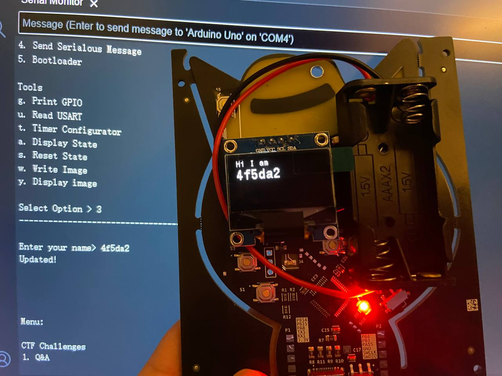
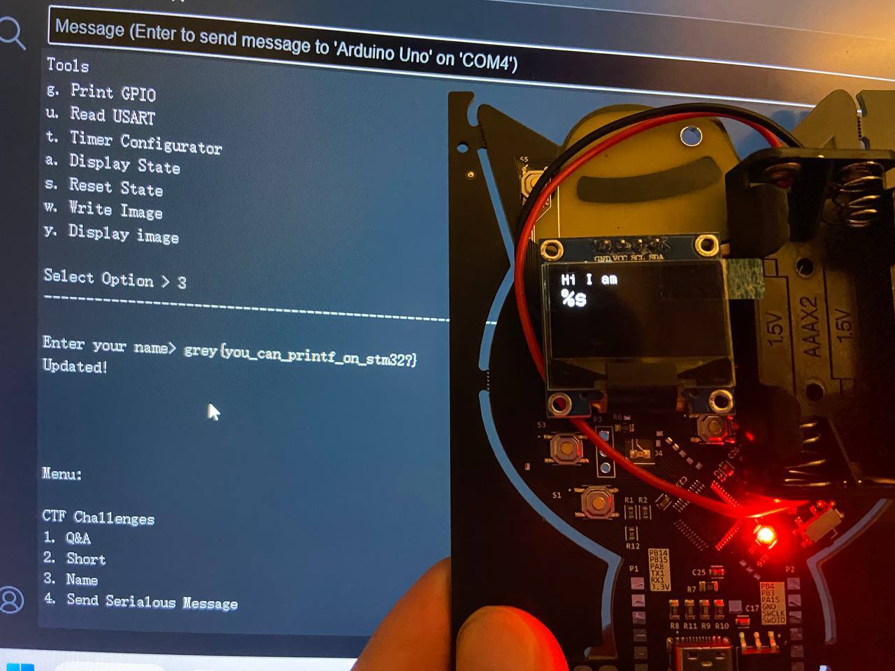

<h1> Name </h1>

### Challenge (712 points, 10 solves)

> GreyCat has an onboard screen where it can communicate with others. Hmm I wonder if there's some special format? Challenge 3.
>
> Author: Hackin7

After choosing the challenge in Arduino IDE's serial monitor, the program asks for a name input, then prints the name and displays it on the badge's OLED screen.

<h3>Analysis </h3>

Since the program prints user input, it is natural to think about similar vulnerabilities in a C program, such as buffer overflow and format string attack. After some trial and error, a format string vulnerability is revealed.

(On hindsight, the challenge description also hints about *format* strings :0)

<h3>Solution</h3>

Provide `%s` as the name input.

Since the program most likely uses `printf(input)`, there's no argument supplied to the `%s` so subsequent strings on the stack will be printed. In this case the first leaked string is the flag.

<h3>Flag</h3>

> grey{you_can_printf_on_stm32?