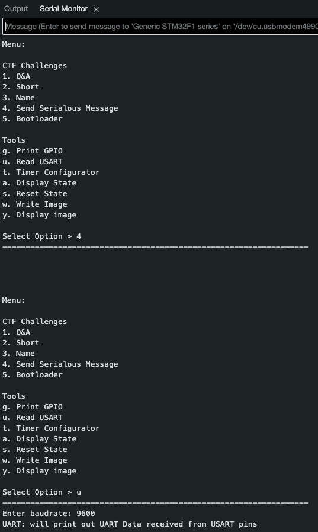

# Serialous

## Challenge (400 points, 14 solves)

> GreyCat has a Serialous message. Help us find out what it means. Challenge 4.
>
> Author: Hackin7

## Summary

This is the 4th challenge in the Hardware category. The program sends some kind of message and we need to read it.

## Analysis

As we haven't used the `u. Read USART` tool in the first 3 challenges, it seems likely that we will need to use it in this challenge to read the message. Just need to figure out how to use it.

I found this [Youtube video](https://www.youtube.com/watch?v=V6m2skVlsQI) quite helpful in understanding the U(S)ART protocol.

## Approach

Connect 2 badges together using the 2 wires given in this format: `RX<->TX` and `GND<->GND`. Then, connect the badges to your computer and run the program. The badge on the `TX` side should run `4. Send Serialous Message` and the badge on the `RX` side should run `u. Read USART`.

It was probably a hint when they gave every team exactly 2 wires :)

## Flag

`grey{uart_read}`
