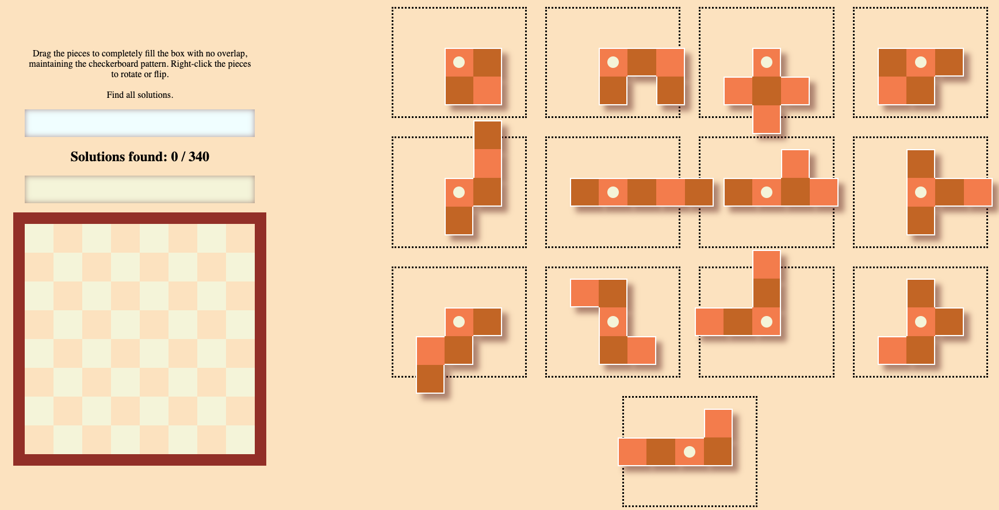

# 13 Piece Puzzle

## Challenge (826 points, 8 solves)

> A puzzle of a lifetime.
>
> Author: JuliaPoo

## Summary

We need to find all 340 solutions to a 13 piece puzzle to get the flag.



## Analysis

A simple backtracking algorithm can be used to solve this puzzle. We can try placing the pieces one by one until we manage to fit all of them to the board.

Taking into account the possible cell to put a piece (`32` because we can only place it on a black cell) and the number of configurations for each piece (some have 8 configurations due to rotations), a rough estimation on the number of possible solutions:

```bash
32P13 * (1 * 2^2 * 4^5 * 8^5) = 2.9 * 10^26
```

Assuming that we can check `10^8` solutions per second, there is no way the above algorithm can finish in a reasonable amount of time. Therefore, we need some heuristics to reduce the search space.

Two pruning strategies that I used:

- By placing the only piece of size 4 first, notice that the 12 pieces are all of size 5. So whenever we reach a state, first run a DFS/BFS floodfill algorithm to count the size of each connected component seperated by pieces we have placed. If there is a component of size that is not divisible by 5, we can prune that state immediately.
- It is better to place the pieces with the least number of configurations first. This is because there are fewer possibilities to check for that piece, and we can prune more states in the future earlier.

Implementing the above strategies in `solve.cpp`, I managed to find all 340 solutions in around 6 minutes.

## Approach

After finding all 340 solutions, the rest is to modify the JavaScript code in `solveme.html` to get the flag.

```js
// MODIFICATIONS START HERE
let arr = [...] // fill in the array with data from `solutions.txt`
for (let i = 0; i < 340; i++) {
    let sol = arr[i];
    solutions_found.push(toHexString(sol));
}
const solstring = [...solutions_found].sort().join("");
window.crypto.subtle
    .digest("SHA-256", fromHexString(solstring))
    .then((c) => console.log(`grey{${toHexString(new Uint8Array(c))}}`));
// MODIFICATIONS END HERE
```

## Flag

`grey{ffd26ed19381530cd0484ec1d32e0188d8801208a942a966043bb492b23c6f92}`
