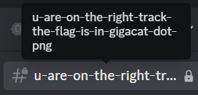
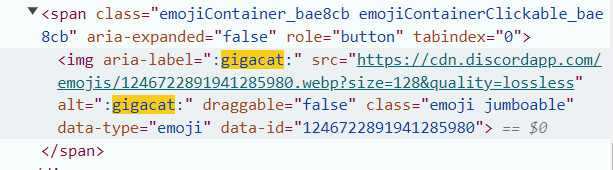
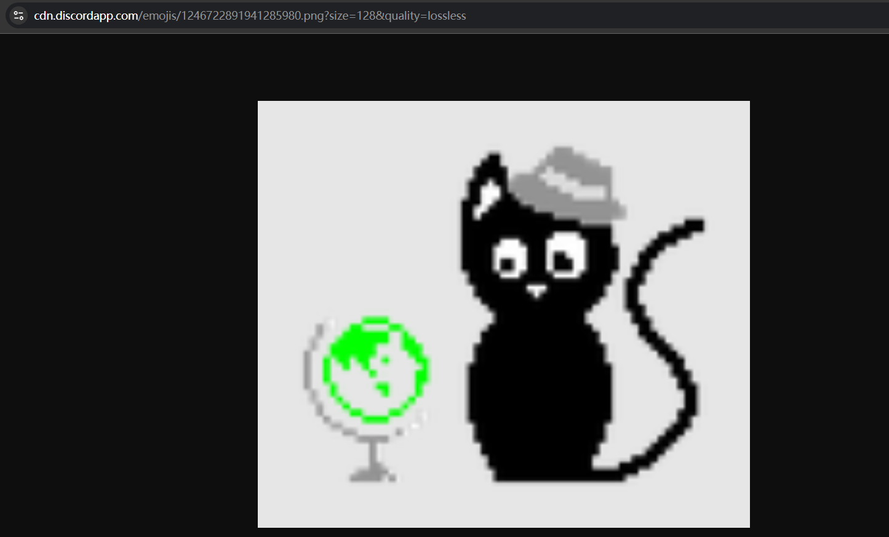
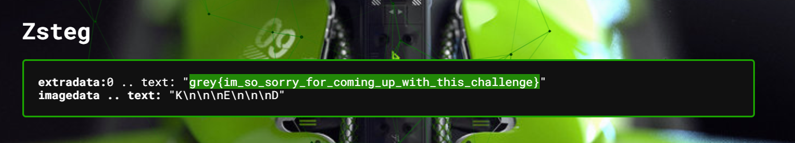

<h1> Discord Insanity Check </h1>

### Challenge (304 points, 15 solves)

> sorry not sorry for making this XD
>
> this challenge can be purely solved via discord. there is no need to osint or look anywhere outside of discord
>
> Author: Elma

Treasure hunt on the Discord server!

<h3>Analysis</h3>

No additional clue was given. After some pointless clicks and stalking random users' personal websites, I decided to focus on these ideas:

* What is newly added to the server close to the competition date?
    - A channel with name :shushing_face::shushing_face::shushing_face:
    - A server emoji called "gigacat"
* What *can* be hidden on a Discord server?
    - Some hidden channels that require permission
    - Hidden stuff in HTML

<h3>Approach</h3>

I found [this tool](https://github.com/JustOptimize/return-ShowHiddenChannels) which is a BetterDiscord plugin. It is able to display the metadata (but not messages) of restricted channels in a server. (wow!)

The hidden channel's name suggests we need to find `gigacat.png`, which is related to the emoji. We can open the discord server in browser and inspect HTML elements to get the emoji's url.

However, this url gives us a webp instead of png. Try changing the extension in the url to png and the png resource also exists in the server!

Upload the png to my favourite [Aperi'Solve](https://www.aperisolve.com/b4ce60b51a39a10c1e0618f9a6e995ab). Upload count is 4, that's good news! Scroll down and we finally receive the author's apology XD

<h3>Solution</h3>

* Display hidden channel name
* Find emoji's url and change extension in url to obtain png
* Find hidden string in png

<h3>Flag</h3>

> grey{im_so_sorry_for_coming_up_with_this_challenge}
