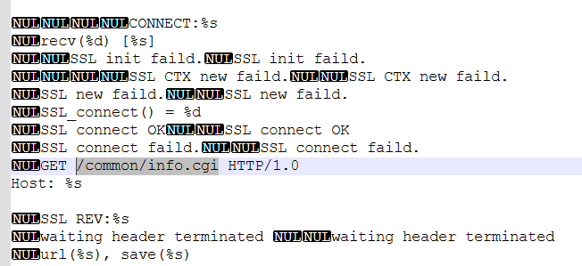

<h1> Ip Camera </h1>

### Challenge (826 points, 8 solves)

> Your target is a high-security IP Camera. The product number for this IP Camera is ____.
>
> You have a foothold with the username "hiddenadmin." But to penetrate deeper, crack the password that follows this structure: hello_{build}_{version}_{mac_address}. The password is hidden somewhere within the camera.
>
> Your ultimate objective? Use the camera's PTZ (Pan-Tilt-Zoom) function to uncover the elusive flag. Good luck, hacker!
>
> \* Note to Participant: There are two vulnerable cameras running, one with the flag and one without. To minimize interfere, all participants can attempt to exploit the camera at 192.168.2.69. After having a working exploit, the participant can approach an organizing member to link them up with the second identical camera with the flag and attempt to solve the challenge.
>
> Someone modified this file to introduce a backdoor!
>
> ```
> IP_Camera\challenge\_DCS-5222L_B1_FW_V2.15.07.decrypted.bin.extracted\_DCS-5222L_B1_FW_V2.15.07.decrypted.bin.extracted\jffs2-root\fs_2\etc\boa.conf
> ```
>
> Author: DSTA
> 
> http://192.168.2.69

In this challenge we are given the local IP address of a camera and its partial file system. Our first objective is to gather information about this camera, including its build number, version and MAC address. Our second goal is to gain unauthorized control of the camera's movement through a backdoor.

<h3>Approach</h3>

Since we connect to the camera via local network, we can use WireShark to sniff packets which contain its MAC address. The build and version information could either be recorded in the file system, or hosted in some remote endpoint.

Despite hours of endless treasure hunting (aka Notepad++ searching), we could not find the correct information in the local files. However, in one local file called `upnpc-ddns`, I found a template log of HTTP request to `/common/info.cgi` endpoint:



This endpoint's name seems to suggest it's publicly available and contains some information. Well, only one way to find out, and yes indeed! (I learnt later that this is a [known CVE](https://nvd.nist.gov/vuln/detail/CVE-2018-18441))

```
model=DCS-5222LB1
brand=D-Link
product=DCS-5222LB
version=2.15
build=07
hw_version=B
nipca=1.9.5
name=DCS-5222LB
location=
macaddr=CA:AC:AC:01:23:45
ipaddr=192.168.2.69
netmask=255.255.255.0
gateway=192.168.2.2
ipaddr1_v6=
prefix1_v6=
gateway_v6=
wireless=yes
ptz=P,T
focus=no
inputs=1
outputs=1
speaker=yes
videoout=no
pir=yes
icr=yes
ir=yes
mic=yes
led=yes
td=no
playing_music=no
whitelightled=no
```

With the password, we can login to the camera, but we only have read access to its video stream, no write access to its configuration. This is where the backdoor comes in.

We found a genuine `boa_template.conf` online and compared it with the malicious `boa.conf` we have. Main differences include:

* It grants the server root access
* It has a lot more aliases which map endpoints to actual directories

The root access may not be useful here since we don't have access to the server yet. Thus, the aliases may be the sus part. In order to test out, I found [this blog](https://lucidar.me/en/ip-camera/dlink-dcs-5222l/#pan-tilt) which explains the CGI APIs to pan / tilt the camera remotely.

We can use for example, `/config/ptz_move.cgi?t=20&p=170` to move the camera, but we are not authorised to use the `/config` endpoint. Upon closer inspection, in our `boa.conf` both `/config` and `/ptz` are mapped to `/opt/ipnc/config/`. That means `/ptz/ptz_move.cgi?t=20&p=170` will be resolved to the same final path as well. It turns out that the `/ptz` alias is not filted and we are able to control the camera with this endpoint. Interesting!


<h3>Solution</h3>

* Visit `http://192.168.2.69/common/info.cgi` to obtain information and get password
* Use `http://192.168.2.69/ptz/ptz_move.cgi?t={tile_amount}&p={pan_amount} to control the camera

<h3>Flag</h3>

> grey{i_hacked_an_ip_camera_owo}
