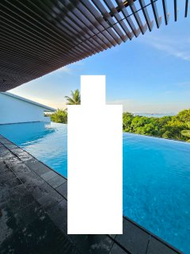
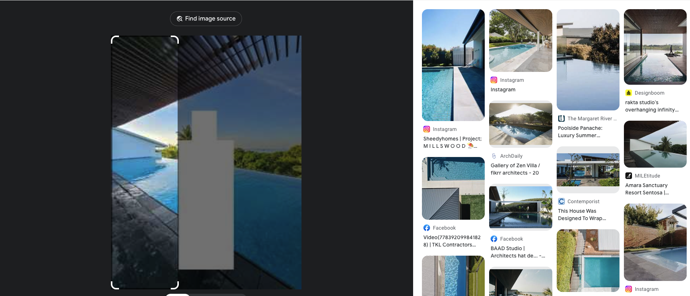
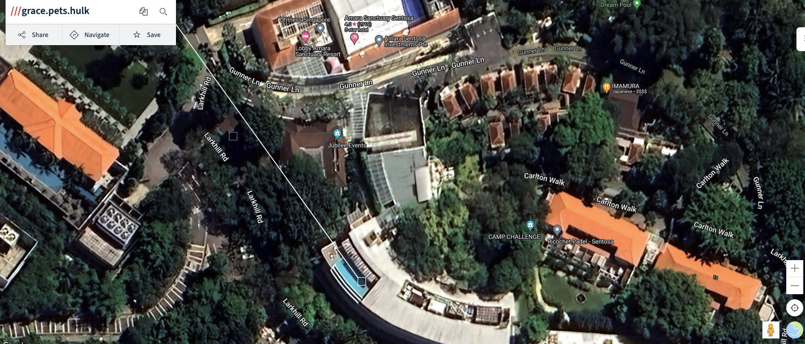

# Poolside Paradise Or Criminal Hideout

## Challenge (200 points, 19 solves)

> Our undercover agents have intercepted a suspicious image. It appears to show a poolside meeting between two criminals. Sources say that the deal happens in the next 24 hours. We know that the location is in Singapore. Can you find the location, or will you allow the deal to go through? Your task is to provide the exact location where the deal is going to take place. To provide the exact location of the pool, please use https://what3words.com/ to generate the location! Flag format: `grey{what.three.words}` *Please note that this story is fictitious and is created solely for educational purposes as part of GreyCTF. It is neither endorsed nor done in collaboration with the venue owner. Please bear in mind when doing your write ups, in case the organisation requests for a take-down
>
> Author: H

## Summary

<!-- Add image -->

Given the image of the hideout, we need to find the exact location of the pool.

## Analysis

A basic OSINT challenge.

## Approach

A quick reverse image search on Google Images will lead us to the name of the building: `Amara Sanctuary Resort Sentosa`. Then we can locate the pool by looking at the map of the map in satellite view.

## Flag

`grey{grace.pets.hulk}`
