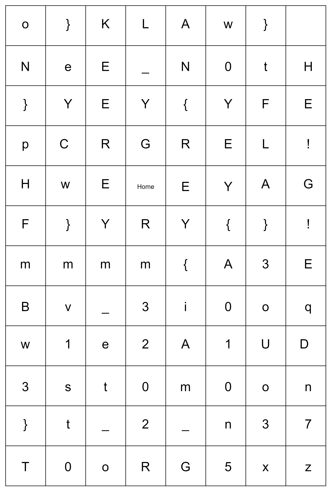

# Grey Divers

### Challenge (100 points, 155 solves)

> Grey Cat has recently got into playing Hell Divers 2 before it disappeared and left this note behind:
> 
> 1. Eagle 500 Kg Bomb
> 2. GL-21 Grenade Launcher
> 3. MD-I4 Incendiary Mines
> 4. Orbital Gas Strike
> 5. Orbital Airburst Strike
> 6. Eagle Rearm
> 7. Eagle 110MM Rocket Pods
> 
> Can you decipher what it is trying to say?
> 
> Author: Junhua



### Analysis

From the given image, there are a lot of possible paths from home that corresponds to a flag. So out task is to figure out the correct direction to move, to obtain the flag.

I did not play Hell Divers, nor Hell Divers 2. I have no idea what the question is talking about. But a Gemini prompt may give me an idea.

Prompt:

```
Grey Cat has recently got into playing Hell Divers 2 before it disappeared and left this note behind:
Eagle 500 Kg Bomb
GL-21 Grenade Launcher
MD-I4 Incendiary Mines
Orbital Gas Strike
Orbital Airburst Strike
Eagle Rearm
Eagle 110MM Rocket Pods

What do these possibly mean?
```

Response:

> These terms are most likely related to Grey Cat's loadout in Helldivers 2, a video game about fighting alien bugs. Here's a breakdown of what they mean:
> 
> * Eagle 500 Kg Bomb: This is a powerful bomb dropped from a spaceship for heavy damage against large targets or fortifications.
> * GL-21 Grenade Launcher: This is a weapon Grey Cat could use for close-quarters combat or flushing out enemies from cover.
> * MD-I4 Incendiary Mines: These mines lay down fire, damaging enemies that walk over them. Useful for creating area denial or slowing down enemy advances.
> * Orbital Gas Strike: This calls down a concentrated cloud of toxic gas on a designated area, likely for eliminating large groups of enemies.
> * Orbital Airburst Strike: This is likely an airstrike that explodes above ground, creating a shockwave to damage enemies in a wide area.
> * Eagle Rearm: This could be a command to resupply the Eagle with ammunition, especially for the bombs and rockets.
> * Eagle 110MM Rocket Pods: These are weapon pods mounted on the Eagle that fire multiple rockets at once, good for taking out groups of enemies or lighter vehicles.
> 
> From this list, it seems Grey Cat favored a mix of heavy explosives for taking out large targets, area denial tools like mines and gas, and a secondary weapon (grenade launcher)for close combat. They also ensured they could restock their main firepower (bombs and rockets) during missions.
> 
> It's important to note that these terms are specific to Helldivers 2 and might not have any meaning outside the game.

I tried more prompts, but there was nothing useful out of it. Ok, so these are some weapons that somehow suggest the direction on the image. So I tried googling for these game weapons. Helldivers wiki does show me something.


At the bottom of the screen are some arrows! These are the weapon activation keys, which must also be the direction to move to on the map.

Following the directions given by the weapons in order, we obtain the following:


The path gives us the flag for the challenge.

### Flag

```
grey{i3mm_e1w3st_2_n3oU10o3E!}
```
