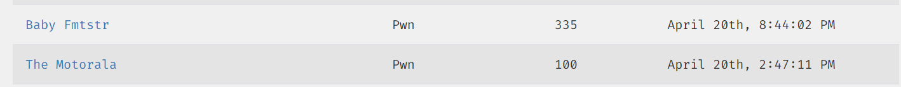
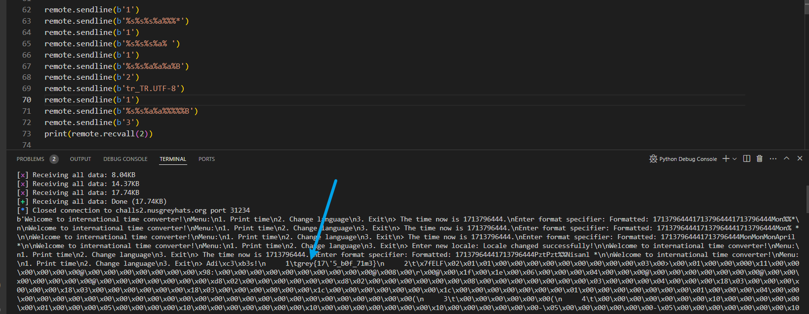

<h1> Baby Fmtstr </h1>

### Challenge (335 points, 44 solves)

> With this new service, you can format your dates in any language
>
> Author: jro
>
> nc challs.nusgreyhats.org 31234

In this challenge, we have a program that displays the current time. User can input string of format specifiers to display the time, as well as change the time locale used by the program.

<h3>Analysis </h3>

The vulnerability lies in the following code:

```c
char output[0x20];
char command[0x20]; // initially 'ls'


void goodbye(){
    puts("Adiós!");
    system(command);
}

void print_time(){
    ...
	fgets(input, 0x20, stdin);
    for(int i = 0; i < strlen(input)-1; i++){
        if(i % 2 == 0 && input[i] != '%'){
            puts("Only format specifiers allowed!");
            exit(0);
        }
    }
    strftime(buf, 0x30, input, time_struct);
    ...
    memcpy(output, buf, strlen(buf));
    ...
}
```

The program copies the formatted time (of at most 48 bytes) into the `output` array which is 32 bytes long. Any characters beyond 32 bytes will be overflown to the `command` array and will be executed when the user calls `goodbye()`.

So, the goal is overflow the `command` array with the correct command that displays the flag. Sounds very easy, right? That's probably why the challenge title says "baby", right?

Unfortunately for me, this coughing baby turned out to be a hydrogen bomb :bomb::sob::sob::sob:



<h3>Approach</h3>

After analysing the challenge, I had the idea to generate formatted string with length decreasing by 1 at each step. For example, in order to have `cat flag.txt` in the `command` array, first generate a 44-byte string ending with `t`, then a 43-byte string ending with `x` and so on. This would work as long as the time representation in different locales is very different - if in some languages, the spelling for the month or day of week ends with `x`, then we are able to inject `x`. However, this was not true :(

After finding the list of all possible locales [here](https://docs.oracle.com/cd/E23824_01/html/E26033/glset.html) and writing a [script](find_locale.py) to find such locales, I discovered that some characters are not available. There's no language where the representation of the current time contains a word ending with `x`. (I shouted out loud when I found that `.` is available, but that turned out to be unhelpful)

Most fatally, the locales fail to generate a time string ending with `c` or `p` (or any string ending with `ca` etc). That means `cat` and `grep` cannot be executed.

Okay, so the challenge is more difficult than it seems! First, I observed that the input validation only checks that characters on even indices are `%`, without verifying each they are valid format specifiers. If the input is `%*`, it will not be translated into time format and will remain `%*` in the output string. That means, `*` is available by putting `%*` as the end of the input string!

Nice, that means we only need something like `cat *`. Now we need to find another linux command that similarly displays every file content in the directory.

This was the most tedious part for me :(( Many of the equivalent commands are not available on the server machine. I tried common commands like `less`, `ul` and `nano`, and other tricks like `. *` (which worked locally: it says `command "grey{fake_flag} not found"`) but none of them worked on the server.

It was after hours of trying that I finally found a command that works on the server. My lifesaver was `nl`, which displays line numbers along with content on each line.



 <h3>Solution</h3>

- input `%s%s%s%a%%%*` to write `*` on `output[35] (command[3])`
- input `%s%s%s%a%[_]` (whitespace after last `%`) to write ` ` on `output[34] (command[2])`
- input `%s%s%a%a%a%B` to write `l` on `output[33] (command[1])`
- change locale to `tr_TR.UTF-8`, whose representation of the month is "Nisan"
- input `%s%s%a%a%%%%%B` to write `n` on `output[32] (command[0])`
- call `goodbye()` to execute `nl *` and get flag

(Not sure if there's an easier way, would love to know the intended solution)

(While creating this writeup, I just realised that `strings` was available on Saturday. OOPS!)

<h3>Flag</h3>

> grey{17'5_b0f_71m3}